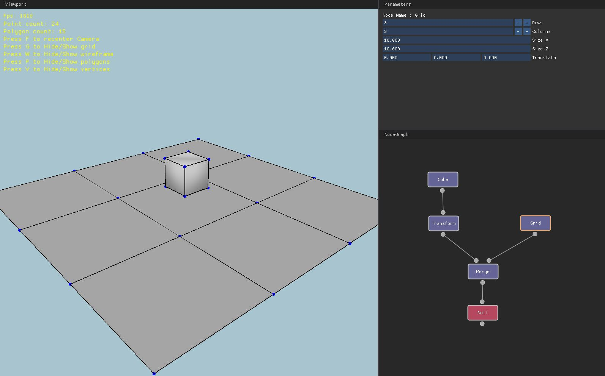

# Euclide WIP

Euclide is a node-based 3D engine currently in development.

## Rendering

You can move with your mouse buttons (pan, zoom, orbit) in the scene.

## Geometry System

I decided to use a half-edge data structure to store mesh data.
