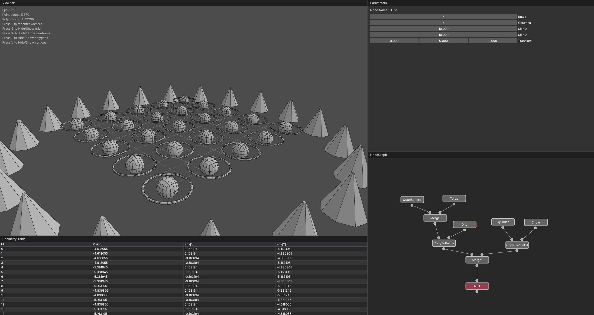

# Euclide WIP

Euclide is a node-based 3D engine currently in development.

## Nodes

Current working nodes: (I will add more over time)
- Cube
- Grid
- Transform
- Merge
- Null

You can create new Node by right clicking on the graph (a dropdown list will appear).
You can cut node connections by holding the 'Y' key and draging on the connection.
You can delete nodes by selecting it and press 'Delete'.

## Viewport

You can move with your mouse buttons (pan, zoom, orbit) in the scene.
Yo can also press F to recenter the camera to the object.
Yo can also press G to toogle the grid visibility.

## Parameters

When you select a node, there is a parameters tab that open.
You can change parameters value !

## Geometry System

I decided to use a half-edge data structure to store mesh data.
